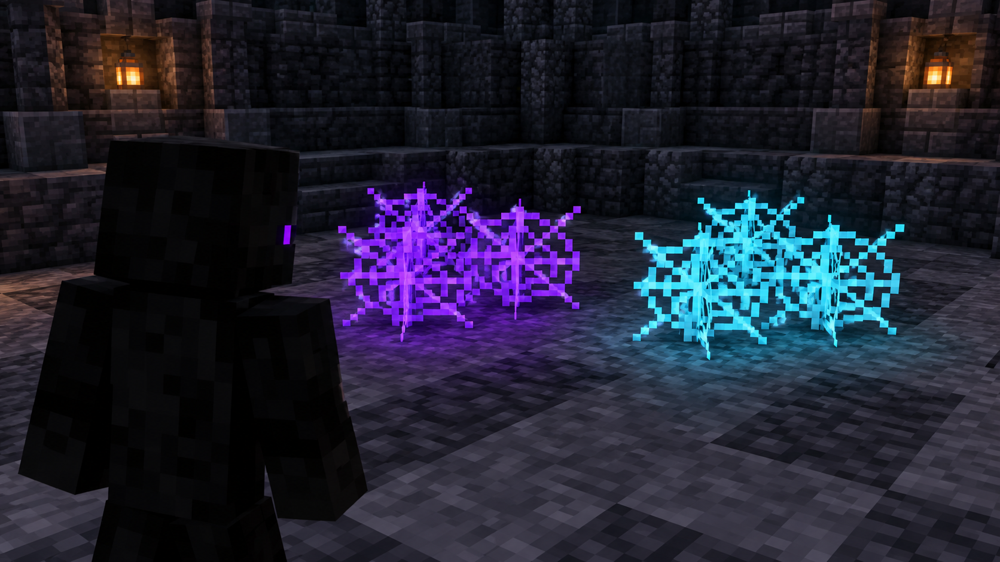

# Cobweb Placement Optimizer

 

**Aim. Place. Switch back. Customize the color.** A Fabric client mod for Minecraft that places a cobweb at your crosshair, restores your previous hotbar slot, and lets you choose how cobwebs look.

## Downloads

| Mod | Download | Fabric API | Java |
|---|---|---|---|
| Cobweb Placement Optimizer 1.21.11 | [Download](downloads/cobweb-placement-optimizer-1.0.6-fabric-1.21.11.jar) | [0.141.6+1.21.11 or matching newer build](https://modrinth.com/mod/fabric-api/versions?g=1.21.11) | 21+ |

Use the JAR for your exact Minecraft version. Requires Fabric Loader, Fabric API, and Mod Menu 17.x for the Configure screen. Client-side mod; install it in your client mods folder.

## Pictures

### Purple cobweb coloration

### Choose a custom color

*These are concept images illustrating the mod's appearance options, not screenshots captured in Minecraft.*

## What it does

- Places a cobweb at the block face under your crosshair with one key or mouse-button press.
- Selects cobwebs from your hotbar, then switches back to your previous slot after the configurable delay.
- Offers original appearance, a solid custom color, or a colored shimmer effect.
- Lets you choose a color with the picker or enter a `#RRGGBB` value.
- Provides a black-and-purple Configure screen with no gameplay status messages.

Open **Mods → Cobweb Placement Optimizer → Configure** to select the binding, restore delay, appearance, and color.

## Links

[Website](https://github.com/082-0/cobweb-placement-optimizer) · [Issues](https://github.com/082-0/cobweb-placement-optimizer/issues)

## License

MIT
