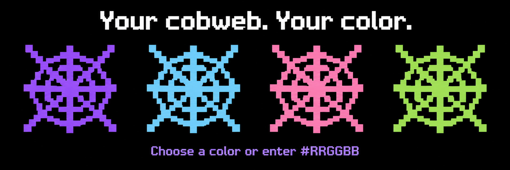

# Cobweb Placement Optimizer

A client mod for Fabric 1.21.11 that places cobwebs where you aim, returns to your previous hotbar slot, and lets you customize cobweb colors.

## Features

- One press attempts one cobweb placement at the block face under your crosshair.
- Selects cobwebs from your hotbar automatically.
- Returns to the hotbar slot you held before activating the action.
- Adjustable switch-back delay from 0 to 5000 ms; default 100 ms.
- Choose a keyboard key or mouse button in Configure.
- The normal Minecraft keybind is named Cobweb.
- When using a hotbar number such as 3, the conflicting hotbar key is reserved for the cobweb action.
- Moving the cobweb key to another button restores the reserved hotbar binding.
- Original appearance, solid custom color, or a pulsing shimmer.
- Click the hue and saturation picker or enter any #RRGGBB hex value.
- Color changes affect all placed cobwebs locally, including resource-pack geometry.
- Black and purple Configure screen.
- Simple purple cobweb icon on a black background.
- GitHub button opens the project repository only when clicked.
- No gameplay status messages.

## Requirements

- Minecraft 1.21.11
- Java 21 or newer
- Fabric Loader 0.18.0 or newer
- Fabric API for Minecraft 1.21.11
- Mod Menu 17.x to access the Configure screen

## Install

1. Download the JAR from [downloads](downloads/cobweb-placement-optimizer-1.0.6-fabric-1.21.11.jar).
2. Place it in your Minecraft instance's mods folder.
3. Install Fabric API and Mod Menu for 1.21.11.
4. Remove an older Cobweb JAR before adding this version.
5. Launch Minecraft.

## Configure and use

Open Mods > Cobweb Placement Optimizer > Configure.

Click the Cobweb binding button, then press the keyboard key or mouse button you want. The binding is also listed in Options > Controls > Key Binds > Cobweb.

Put cobwebs in your hotbar. Aim at a reachable block face and press the selected button. Minecraft's normal block interaction determines whether placement succeeds.

Set Restore delay (ms) to control the time before the previous slot is restored. The action runs on client ticks, normally about 50 ms apart. If you manually change slots during that delay, your manual selection is respected.

For coloration, select Solid color or Shimmer. Click the color picker or type a six-digit value such as #A855F7. Click Save & Done.

## In-game-style showcase

These are generated concept images of the color options, not screenshots of the mod running. The mod applies one selected color to nearby placed cobwebs at a time.

## Color showcase

Promotional artwork illustrating color choices; not an in-game screenshot.

## Appearance details

Solid color changes the tint of placed cobwebs. Shimmer pulses the chosen color toward white on nearby cobwebs. It is a color pulse rather than an item enchantment overlay.

The renderer wraps the loaded cobweb model so resource-pack geometry is preserved. Other players see their own cobweb appearance.

The picker controls hue and saturation. Use the hex field for any exact RGB color, including darker shades.

## Saved settings

Color, appearance, delay, and the reserved hotbar binding are stored in config/cobweb.properties. The activation binding is saved in Minecraft's options.

## Build from source

Use Java 21 and run gradlew.bat build on Windows, or ./gradlew build on Linux/macOS.

The remapped mod is created in build/libs/.

## Validation

Version 1.0.6 fixes startup crashing when the mod initializes before Minecraft's client options are ready. It compiles and remaps for Fabric 1.21.11. Minecraft runtime, renderer compatibility, and Grim behavior need in-game verification. No anti-cheat compatibility guarantee is made.

## Author and support

GitHub: https://github.com/082-0/cobweb-placement-optimizer
Issues: https://github.com/082-0/cobweb-placement-optimizer/issues

## License

MIT

